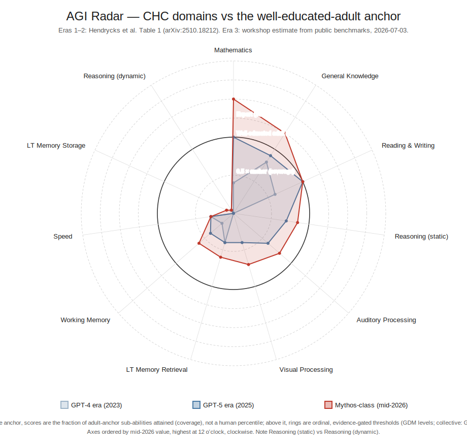

# AGI Radar

Three model eras — GPT-4 (2023), GPT-5 (2025), and the mid-2026 frontier —
plotted across Hendrycks et al.'s ten CHC cognitive domains, with reasoning
split into static vs dynamic. Radial scale: 100 = the "well-educated adult"
anchor; rings above it are ordinal capability thresholds (GDM performance
levels, then collective levels). Axes ordered by mid-2026 value, highest at
12 o'clock.

**The headline:** the capability profile is jagged. Mathematics and knowledge
have burst through the human anchor (Virtuoso / Expert rings) while dynamic
reasoning (~5/100, ARC-AGI-3 family) and long-term memory storage (~10/100)
stay pinned near the floor — three years of frontier progress with almost no
movement on either.

**Era 1–2 values are the published Hendrycks Table 1 scores. Era 3 is our
benchmark-mapped estimate, not a published score** — dated 2026-07-03,
adversarially reviewed, and offered for scrutiny.

## Audit it — don't trust it

Everything needed to verify this chart is in this repository:

- **[AUDIT.md](AUDIT.md)** — the third-party verification procedure (5 steps,
  ~10 minutes, needs only Python ≥3.11 stdlib).
- **[recipe.md](recipe.md)** — claim, inputs, data, method (every judgment
  call disclosed), and exact regeneration commands. Pinned artifact hash:
  `e8841f7b1bfab5ea6b0b9483029783493d7b12ca19be1dbc685913e73ea63733`.
- **[THREAD.md](THREAD.md)** — the complete append-only work log: sources
  verified at origin, an adversarial second-model review that moved four
  scores, two operator-caught errors and their on-the-record corrections.
- **[data/](data/)** — verified Table 1 extract, per-axis mid-2026 evidence
  with sources and dates, the plotting series, and a dated EOY-2026
  projection (scoreable against reality in January 2027).
- **[refs/](refs/)** — the three anchor papers (redistribution licenses in
  [refs/LICENSES.md](refs/LICENSES.md)), checksummed.
- **[code/radar.py](code/radar.py)** — ~150 lines of stdlib Python; the SVG
  is a pure, deterministic function of the data CSV.

This repository is the published mirror of a thread in a private analytical
workspace; its git history is the incremental provenance record (subtree
split of the original thread commits, verbatim).

---
*Workshop-internal notes: THREAD.md protocol lives in the private repo's
AGENTS.md; pandoc exports go to `exports/` (untracked).*
